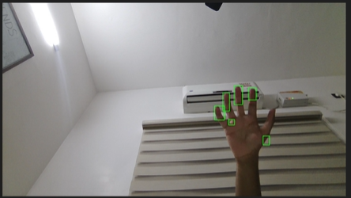

# 🤖 Motion Detection using OpenCV

A real-time **Motion Detection System** built using **Python** and **OpenCV** that detects movement through a webcam, highlights moving objects using bounding boxes, and automatically captures snapshots whenever motion is detected.

---

## 📖 Project Overview

This project demonstrates the fundamentals of **Computer Vision** using OpenCV. It continuously monitors a webcam feed, compares consecutive frames to identify movement, and detects significant changes in the scene.

When motion is detected, the application:

* 📦 Draws a bounding box around the moving object
* 📸 Saves a snapshot automatically
* 🎥 Displays the live processed video feed

This project was my introduction to Computer Vision and laid the foundation for more advanced Edge AI and surveillance projects.

---

# ✨ Features

* 🎥 Real-time webcam processing
* 🚶 Motion detection using frame differencing
* 📦 Bounding box generation
* 📸 Automatic snapshot capture
* ⚡ Lightweight implementation
* 🖥️ Easy to run on any computer with a webcam

---

# 🛠️ Technologies Used

| Technology | Purpose              |
| ---------- | -------------------- |
| Python     | Programming Language |
| OpenCV     | Computer Vision      |
| NumPy      | Image Processing     |

---

# ⚙️ Working Principle

1. Capture live webcam frames.
2. Convert frames to grayscale.
3. Apply Gaussian Blur to reduce noise.
4. Compare consecutive frames.
5. Apply thresholding to identify moving regions.
6. Detect contours.
7. Draw bounding boxes.
8. Save an image whenever motion is detected.

---

# 📸 Demo

## Motion Detection




---

# 📂 Project Structure

```text
motion-detection-opencv
│
├── motiondetector.py
├── README.md
└── screenshots
    ├── motion-detected.png
    ├── bounding-box.png
    └── snapshot-saved.png
```

---

# 🚀 Installation

Clone the repository

```bash
git clone https://github.com/gauravthampy07/motion-detection-opencv.git
```

Install dependencies

```bash
pip install opencv-python numpy
```

Run the project

```bash
python motiondetector.py
```

---

# 🚀 Future Improvements

* Human detection using YOLO
* Person detection instead of generic motion
* ESP32-CAM integration
* Motion heatmap visualization
* Email notifications
* Edge AI deployment
* Deep learning-based object detection

---

# 📚 Learning Outcomes

Through this project I learned:

* Computer Vision fundamentals
* Image preprocessing
* Contour detection
* Frame differencing
* Real-time video processing
* Motion detection algorithms
* OpenCV basics

---

# 👨‍💻 Author

**Gaurav Thampy**

B.Tech Electronics and Communication Engineering

SRM Institute of Science and Technology

GitHub: https://github.com/gauravthampy07

---

⭐ If you found this project useful, consider giving it a **Star**!
